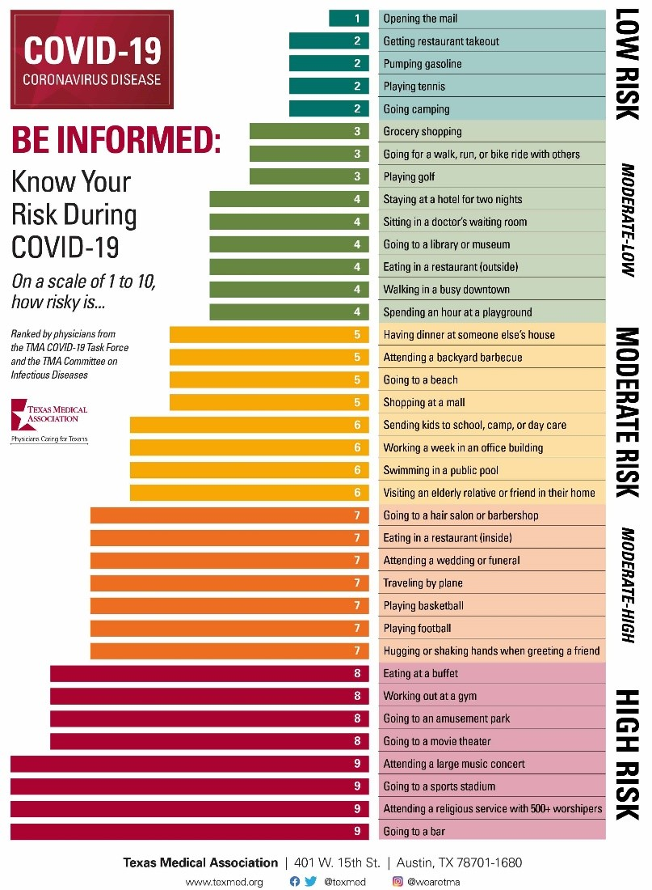
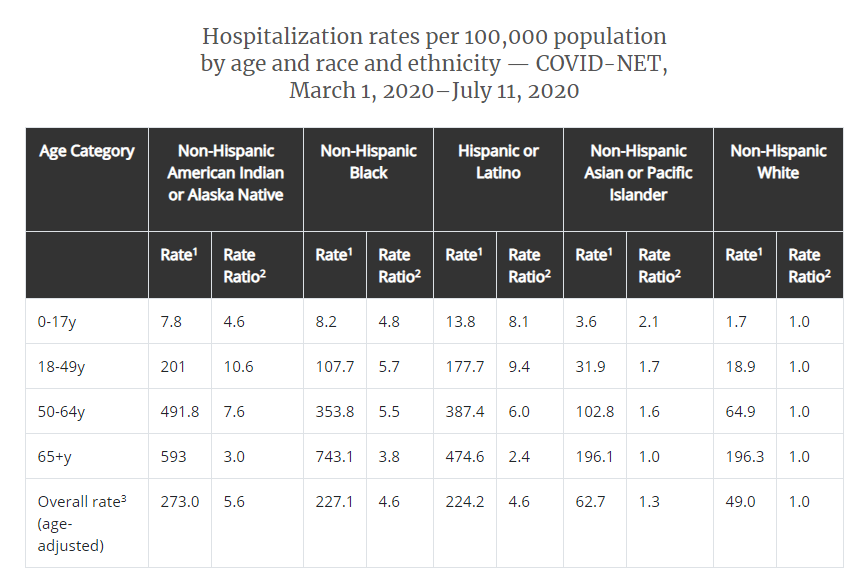

# COVID_APP

This is an app I designed on the ionic platform using typescript for the HCL BetterHealth hackathon. The app takes pre-existing conditions, demographic data, location, and precautionary steps, and finally, an activity and displays a time versus probability of showing symptoms that are directly related to having COVID-19. The app has two main buttons: a preview button and a submit button. The preview button displays the probability before and after having undertaken the task to provide the user an idea of how much exposure to the virus he or she may face, potentially influencing a decision. The submit would usually be pressed after the activity, and this adds the COVID probability to the overall line. The possibilities of catching COVID are derived from the CDC website (https://www.cdc.gov/coronavirus/2019-ncov/covid-data/covidview/index.html), and these are used in the app. If you are a young Asian woman, you're probability of getting COVID is much less likely than an elderly black male. The data from the app is stored locally on the cellphone, and retrieved at startup on the next use, so it doesn't forget the previous session when adding new curves to the graph. 

Some of the things I would like to work on in the future are the following:
1.	Continuously updated probabilities for each of the demographic data. As of now these are hard coded based on the current week’s CDC recommendation. 
2.	A second graph that can show the length of time of symptoms after having captured the virus, and the severity of the symptoms, but I do not think this is quite possible. 
3.	More personalized curves based on demographics. For now, the curve is an offset normal distribution set to be 8 days in the future (based on CDC’s statement that COVID symptoms take 2-14 days to set in), with 2 day standard deviation (so that 99% of the curve is from 2-14 days).  

The activities list is from the following graphic:

The are 9 different level of activities, which are converted to 1/9 for the lowest exposure activites, all the way to 9/9 for the highest risk activity. All the actvities are available in the drop-down menu of the app.

And the probability of showing COVId symptoms comes from the CDC weekly news on COVID (https://www.cdc.gov/coronavirus/2019-ncov/covid-data/covidview/index.html)

The gender incidence rate was determined by the article:  Gender Differences in Patients With COVID-19: Focus on Severity and Mortality (https://www.frontiersin.org/articles/10.3389/fpubh.2020.00152/full). 

The pre-conditions are taken into acccount by calculating an impact factor, which is simply the number of pre-conditions the user has. If the user has 2 pre-conditions, such as having diabetes and being obese, then the amplification factor is 3 (1+isDiab+isOb). 

The precautions start off with a base ratio of 0.5 (so there is a 100% chance of getting the virus), and 12.5% gets subtracted for each precautionary step taken. 

An unsigned apk of the app is available at: https://drive.google.com/drive/folders/15O6EDGBurLHvugzKDhGVGpEsMPz5RW1n?usp=sharing

